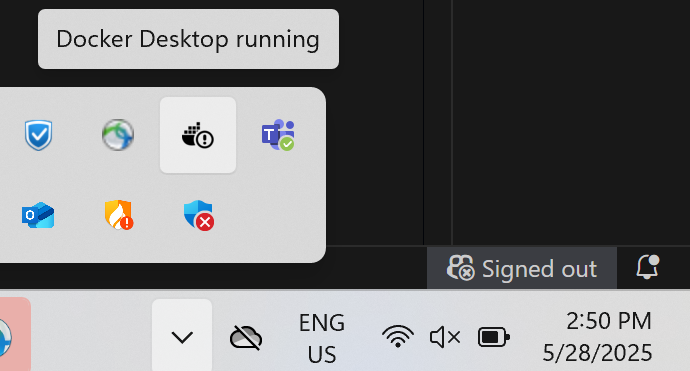
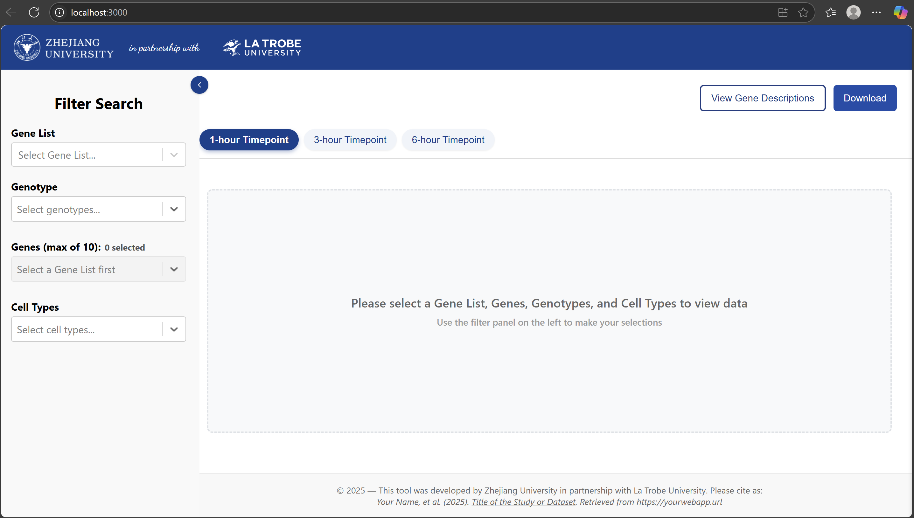

# Quick Start Guide: Local Deployment of the Arabidopsis Web App
This guide walks you through how to run the containerized version of the web application on a new local computer.


## 1. Download and Install Docker Desktop
Download the Docker Desktop installer that matches your operating system from the official Docker website:

https://www.docker.com/products/docker-desktop/

After downloading, run the installer and follow the setup instructions. Once installed, make sure Docker Desktop is running—you should see the Docker icon in your system tray or menu bar.



## 2. Pull docker container
Use the command below to download the container image from the GitHub Container Registry:
```
docker pull ghcr.io/miguel-abulencia/arabidopsis-reactjs:latest
```

> add a screenshot of the terminal

## 3. Run the docker container
Start the container using the following command:
```
docker run -d -p 3000:80 --name arabidopsis-container ghcr.io/miguel-abulencia/arabidopsis-reactjs
```
-  `-d` runs the container in the background

- `-p 3000:80` maps your local port 3000 to the container’s port 80

- `--name` gives the container a readable name

> add screenshot of the terminal


## 4. View the Web App
Once the container is running, open your web browser and navigate to:
```
http://localhost:3000
```

> add screenshot of the browser


# Quick Start Guide: Navigating through the Arabidopsis Web App
This guide provides a quick overview of how to explore and interact with the Arabidopsis Web App. It highlights key features, filters, and visualizations to help you make the most out of the data presented in the application.

## Landing Page


## Filter Sidebar
The filter sidebar, which can be toggled on or off using the button with the `<` or `>` button, allows you to narrow down the data displayed in the web app through a set of intuitive search bars. You can apply filters based on the following criteria:

- **Gene List** – Select from predefined gene lists to focus your analysis.
- **Genotype** – Filter data by one or more genotypes of interest.
- **Genes** – Search and select specific genes to visualize. *Note: A maximum of 10 genes can be selected at a time.*
- **Cell Types** – Choose relevant cell types to refine the results.

## Timepoint tabs
The Timepoint tabs allow you to toggle between different timepoints in the dataset. Selecting a tab displays a heatmap corresponding to that specific timepoint, visualizing gene expression levels based on your selected filters.

> Note: Clusters with the same name across different timepoints are distinct and should not be compared directly, as they may represent different underlying cell populations.

## Description Sidebar
The Description Sidebar can be accessed by clicking the **"View Gene Descriptions"** button. It provides additional information about the selected genes, including gene names, functional descriptions, and other relevant annotations.

## Download button
The **Download** button allows you to export data for the currently selected genes at the active timepoint. The data is downloaded in `.xlsx` (Excel) format, making it easy to view, share, or analyze offline.